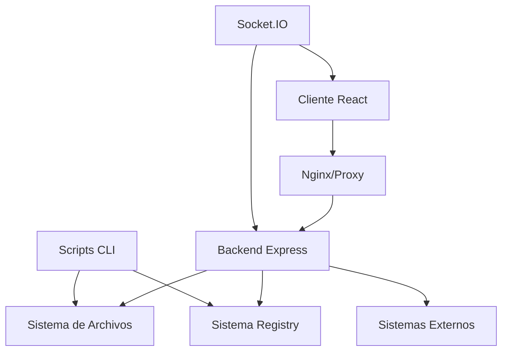

# 🏗️ Arquitectura del Meta Sistema de Gestión

## 📋 Vista General

El Meta Sistema de Gestión es una plataforma centralizada diseñada para administrar múltiples sistemas empresariales desde una sola interfaz. Utiliza una arquitectura moderna de microservicios con tecnologías web estándar.

## 🎯 Componentes Principales

### 1. 🖥️ Frontend (React + Material-UI)
```
frontend/
├── src/
│   ├── components/          # Componentes reutilizables
│   │   └── layout/         # Componentes de layout
│   ├── contexts/           # Contextos de React
│   ├── pages/              # Páginas principales
│   ├── services/           # Servicios API
│   └── utils/              # Utilidades
├── public/                 # Archivos estáticos
└── build/                  # Build de producción
```

**Tecnologías:**
- React 18 con Hooks
- Material-UI v5 para componentes
- React Router para navegación
- Socket.IO Client para tiempo real
- Axios para peticiones HTTP
- Chart.js para gráficos

### 2. ⚙️ Backend (Node.js + Express)
```
backend/
├── src/
│   ├── routes/             # Rutas de la API
│   ├── services/           # Lógica de negocio
│   ├── config/             # Configuraciones
│   ├── middleware/         # Middlewares personalizados
│   └── utils/              # Utilidades del servidor
├── logs/                   # Archivos de log
└── uploads/                # Archivos subidos
```

**Tecnologías:**
- Node.js 18+ con Express
- Socket.IO para comunicación en tiempo real
- JWT para autenticación
- bcryptjs para hash de contraseñas
- Winston para logging
- Multer para subida de archivos

### 3. 🗂️ Sistema de Archivos
```
meta-sistema-gestion/
├── scripts/                # Scripts de automatización
├── templates/              # Plantillas de sistemas
├── docs/                   # Documentación
└── tests/                  # Pruebas automatizadas
```

## 🔄 Flujo de Datos

### Arquitectura Cliente-Servidor


### Comunicación en Tiempo Real
- **WebSockets** para notificaciones instantáneas
- **Server-Sent Events** para logs en tiempo real
- **Polling** para actualizaciones de estado

## 🏛️ Patrones Arquitectónicos

### 1. **Repository Pattern**
```javascript
// SystemRegistry.js - Centraliza gestión de sistemas
class SystemRegistry {
  async getAllSystems()
  async getSystem(id)
  async registerSystem(config)
  async updateSystem(id, data)
}
```

### 2. **Observer Pattern**
```javascript
// Socket.IO Events
io.on('connection', (socket) => {
  socket.on('join-system', (systemId) => {
    socket.join(`system-${systemId}`);
  });
});

// Notificar cambios
io.to(`system-${systemId}`).emit('system-updated', data);
```

### 3. **Strategy Pattern**
```javascript
// Diferentes estrategias de despliegue
const deployStrategies = {
  'react-firebase': deployReactFirebase,
  'node-express': deployNodeExpress,
  'full-stack': deployFullStack
};
```

### 4. **Factory Pattern**
```javascript
// Creación de sistemas desde plantillas
class SystemFactory {
  createSystem(template, config) {
    switch(template.type) {
      case 'react': return new ReactSystem(config);
      case 'node': return new NodeSystem(config);
    }
  }
}
```

## 🔐 Seguridad

### Autenticación y Autorización
- **JWT Tokens** para autenticación stateless
- **Role-based Access Control (RBAC)**
- **Session Management** con timeouts
- **Rate Limiting** para prevenir ataques

### Seguridad de Archivos
- **Validación de rutas** para prevenir path traversal
- **Whitelist de extensiones** permitidas
- **Sandbox de ejecución** para scripts
- **Backups automáticos** antes de modificaciones

### Comunicación Segura
- **HTTPS/WSS** en producción
- **CORS** configurado correctamente
- **Security Headers** (Helmet.js)
- **Input Validation** en todas las rutas

## 📊 Gestión de Estado

### Frontend (React Context)
```javascript
// AuthContext - Estado de autenticación
const AuthContext = createContext();

// SystemContext - Estado de sistemas
const SystemContext = createContext();
```

### Backend (In-Memory + Persistence)
```javascript
// Registry en memoria para acceso rápido
const systemsRegistry = new Map();

// Persistencia en archivos JSON
const persistToFile = async (data) => {
  await fs.writeJson(configPath, data);
};
```

## 🚀 Escalabilidad

### Horizontal Scaling
- **Load Balancer** con Nginx
- **Multi-instance** con PM2
- **Container Orchestration** con Docker Compose
- **Database Clustering** (futuro)

### Vertical Scaling
- **Memory Management** eficiente
- **Connection Pooling** para bases de datos
- **Caching Strategies** con Redis
- **Resource Monitoring** con métricas

### Performance Optimizations
- **Code Splitting** en React
- **Lazy Loading** de componentes
- **API Response Caching**
- **File Compression** (Gzip)

## 🔄 CI/CD Pipeline

### Development Workflow
```bash
git push → GitHub Actions → Build → Test → Deploy
```

### Production Deployment
```bash
npm run build → Docker Build → Container Registry → Production
```

### Monitoring & Rollback
- **Health Checks** automáticos
- **Error Tracking** con logs
- **Rollback Strategy** con versiones anteriores
- **Blue-Green Deployment** (futuro)

## 📈 Monitoreo y Observabilidad

### Métricas del Sistema
- **System Health** en tiempo real
- **Performance Metrics** (CPU, Memory, Disk)
- **API Response Times**
- **Error Rates** y logging

### Business Metrics
- **Sistemas activos/inactivos**
- **Despliegues por día/semana**
- **Uso de funcionalidades**
- **Tiempo de actividad**

### Logging Strategy
```
Level: ERROR | WARN | INFO | DEBUG
Format: [timestamp] [level] [module] message
Rotation: Daily, max 5 files, 10MB each
```

## 🔮 Futuras Extensiones

### Plataforma como Servicio (PaaS)
- **Multi-tenant Architecture**
- **Resource Isolation**
- **Billing & Usage Tracking**
- **API Gateway** avanzado

### Integración con Cloud Providers
- **AWS Integration** (EC2, S3, RDS)
- **Google Cloud** integration
- **Azure** support
- **Kubernetes** orchestration

### AI/ML Features
- **Predictive Scaling**
- **Anomaly Detection**
- **Automated Issue Resolution**
- **Performance Optimization** suggestions

---

Esta arquitectura proporciona una base sólida y escalable para la gestión centralizada de múltiples sistemas empresariales, con capacidad de extensión y adaptación a futuras necesidades.